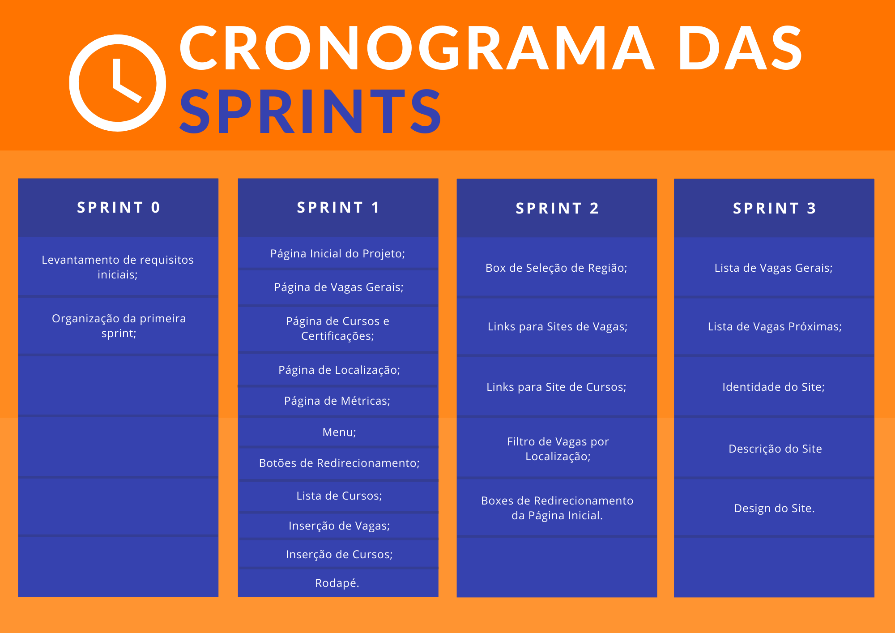
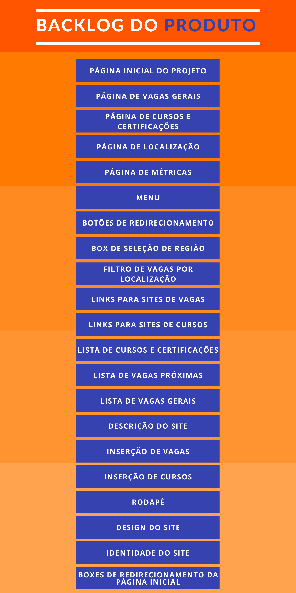
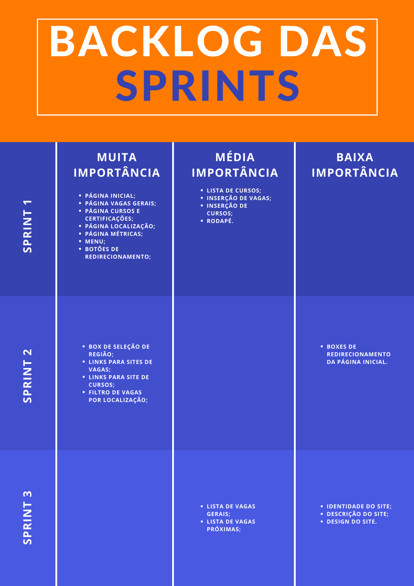

# API 1º Semestre 2022 - Equipe Átomo

  

  <a href ="#o-projeto"> Projeto </a>  • 
  <a href ="#proposta"> Proposta </a>  • 
  <a href ="#cronograma-das-sprints"> Sprints </a>  • 
  <a href ="#product-backlog">Product Backlog </a>  •
  <a href ="#sprints-backlog">Sprints Backlog </a>  •
  <a href ="#1ª-sprint">1ª Sprint</a>  •
  <a href ="#equipe"> Equipe </a> 

 

## O Projeto
 

**Status do Projeto: Em andamento**  
- O objetivo deste projeto é o desenvolvolvimento um sistema web para automatizar o processo de catalogar vagas de diversas profissões principalmente TI e configurar métricas para pontos como tipos de conhecimento, habilidades e competências. Visualmente deverá ter informações do tipo estratégicas (gráficos), facilidades de usabilidade e operação bem como toda a documentação de desenvolvimento lastreado no Github com todos os processos necessários para a fidelização do cliente.

 

## Proposta

**Desenvolver um Site  com os seguintes requisitos:**  

 > **Requisitos**

 - Linguagem Python (Requisito Fatec)
 - Linguagem HTML e CSS (Requisito Fatec)
 - Uso do framework Bootstrap
 - Apresentação via Github
 - O sistema web deverá ter no minimo 5 páginas (Página principal do projeto, Vagas de Emprego, Cursos e Certificações, Métricas (conhecimentos necessários, habilidades e requisitos) e Localização (vagas e cursos))
 
  

**:link: Clique no link abaixo para visualizar o modelo do site.**  
> [Protótipo do Site](https://www.figma.com/proto/ZNn6ZE53cECwrjPMXIQr2n/API---Layout-do-Site?node-id=1526%3A435598&scaling=scale-down&page-id=1526%3A435597&starting-point-node-id=1526%3A435598)

 

## Cronograma das Sprints

<h1 align="center"> </h1>

 

## Product Backlog

<h1 align="center"> </h1> 

 

## Sprints Backlog 

<h1 align="center"> </h1> 

 

## 1ª Sprint

<h1 align="center">Navegação pelas páginas HTML</h1>

https://user-images.githubusercontent.com/100942191/163289232-f9a0bd3d-3874-4d14-b61a-72856428cb42.mp4

 

## Equipe 

 

|Nome|Função|GitHub|
| -------- |-------- |-------- |
|**Rebeca Gama**|Scrum Master|[@GitHub](https://github.com/RebecaGama)|
|**João Gabriel**|Product Owner|[@GitHub](https://github.com/JoaoGRMira)|
|**Elisa Carvalho**|Desenvolvedor|[@GitHub](https://github.com/elisadsc)|
|**Nicholas Guilherme**|Desenvolvedor|[@GitHub](https://github.com/NicholasGui29)|
|**Víctor Henrique**|Desenvolvedor|[@GitHub](https://github.com/ViktorHenrique)|

 
